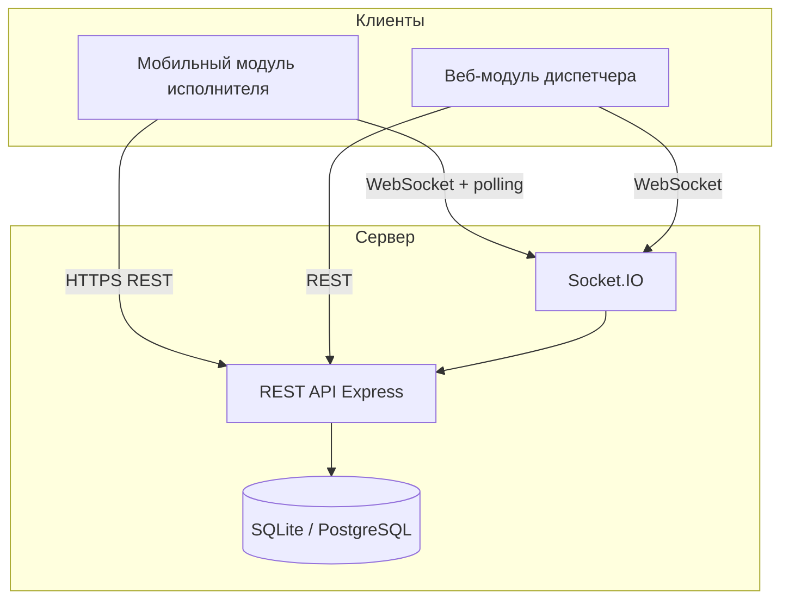
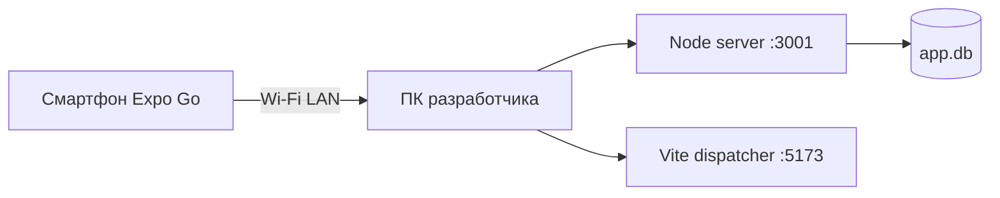
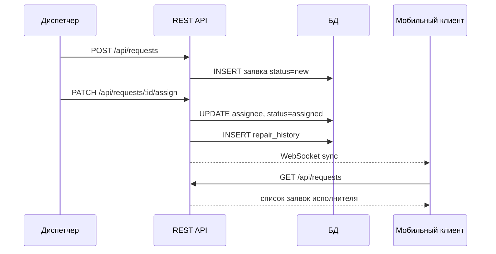

# Архитектура системы (дипломный проект)

## Назначение

Корпоративная система управления **выездным сервисом и ремонтом** состоит из трёх клиентских модулей и единого API:

| Модуль | Технология | Роль |
|--------|------------|------|
| Мобильное приложение | Expo / React Native | Выездной специалист (исполнитель) |
| Веб-панель диспетчера | React + Vite | Регистрация заявок, назначение |
| Сервер API | Node.js + Express | Бизнес-логика, БД, WebSocket |

## Диаграмма компонентов

## Диаграмма развёртывания

## Синхронизация статусов

1. Исполнитель меняет статус заявки → `PATCH /api/requests/:id/status`.
2. Сервер пишет запись в `repair_history` и обновляет `service_requests`.
3. Сервер рассылает событие `sync` через Socket.IO.
4. Диспетчер и мобильное приложение обновляют списки (WebSocket + резервный polling 15 с на телефоне).

## Диаграмма последовательности (назначение заявки)

## Стек

- **СУБД (разработка):** SQLite (`better-sqlite3`) — не требует установки PostgreSQL.
- **СУБД (продакшен / записка):** PostgreSQL — скрипт `server/schema.postgresql.sql`.
- **Аутентификация:** JWT (Bearer token), роли `dispatcher` | `executor`.
