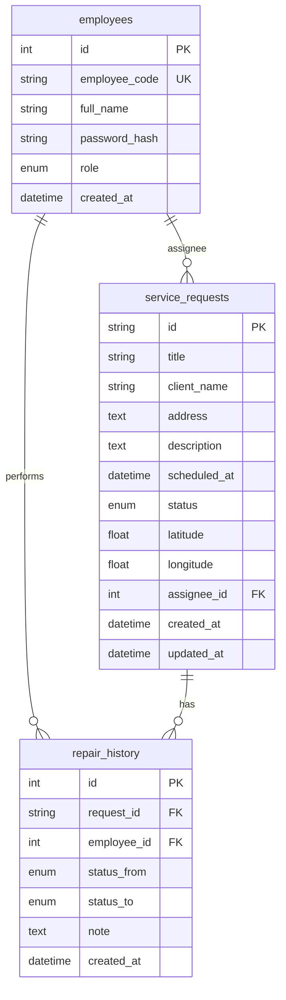

# Модель базы данных

## ER-диаграмма

## Таблицы

### employees (сотрудники)

| Поле | Описание |
|------|----------|
| employee_code | Табельный номер (логин) |
| role | `dispatcher` — диспетчер, `executor` — выездной специалист |

### service_requests (заявки на выезд)

| Статус | Значение |
|--------|----------|
| new | Создана диспетчером |
| assigned | Назначен исполнитель |
| in_progress | Специалист начал работу |
| completed | Работы завершены |
| cancelled | Отменена |

### repair_history (история ремонтов / статусов)

Каждое изменение статуса фиксируется с привязкой к заявке и сотруднику — для отчётности и пояснительной записки.

## Демо-учётные записи

| Роль | Логин | Пароль |
|------|-------|--------|
| Диспетчер | DISPATCHER | demo123 |
| Исполнитель | 405IS | demo123 |
| Исполнитель | EXEC02 | demo123 |

Скрипт заполнения: `npm run server:seed` из корня проекта.

## PostgreSQL

Полный DDL для промышленного варианта: `server/schema.postgresql.sql`.
